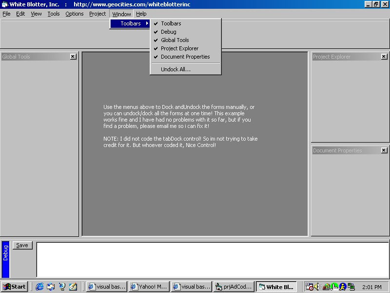



## FIX :TabDock Control with Error Free Example

### Description

THIS IS A FIX FOR MY LAST SUBMISSION * ALL FILES ARE INCLUDED! Look in the "RELATED" folder for the tab dock control. COMPILE THE TABDOCK CONTROL, then add it to the MDI form that is included. IF you have any more concerns...contact me on AIM: CAaronWright!

This is a nice example of the TabDock control at work. I did not write the control, but I did fix alot of errors in it, so this control should run smoothly now. The example included, however, was written by me, and also works perfectly! The example will show you how to Dock and Undock four different forms all at one time, or individually via Menus. (See screenshot for more detail) This is pretty much like the VB environment, so have fun, and If you like it, please vote, thanks!
 
### More Info
 

             |
---                |---
**Submitted On**   |2001-12-10 18:39:10
**By**             |[Aaron Wright](https://github.com/Planet-Source-Code/PSCIndex/blob/master/ByAuthor/aaron-wright.md)
**Level**          |Intermediate
**User Rating**    |3.2 (19 globes from 6 users)
**Compatibility**  |VB 6\.0
**Category**       |[Custom Controls/ Forms/  Menus](https://github.com/Planet-Source-Code/PSCIndex/blob/master/ByCategory/custom-controls-forms-menus__1-4.md)
**World**          |[Visual Basic](https://github.com/Planet-Source-Code/PSCIndex/blob/master/ByWorld/visual-basic.md)
**Archive File**   |[FIX\_\_TYabD4096312102001\.zip](https://github.com/Planet-Source-Code/aaron-wright-fix-tabdock-control-with-error-free-example__1-29651/archive/master.zip)

### API Declarations

FIXED * See Example

